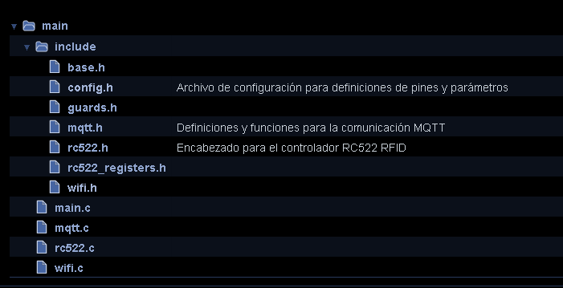
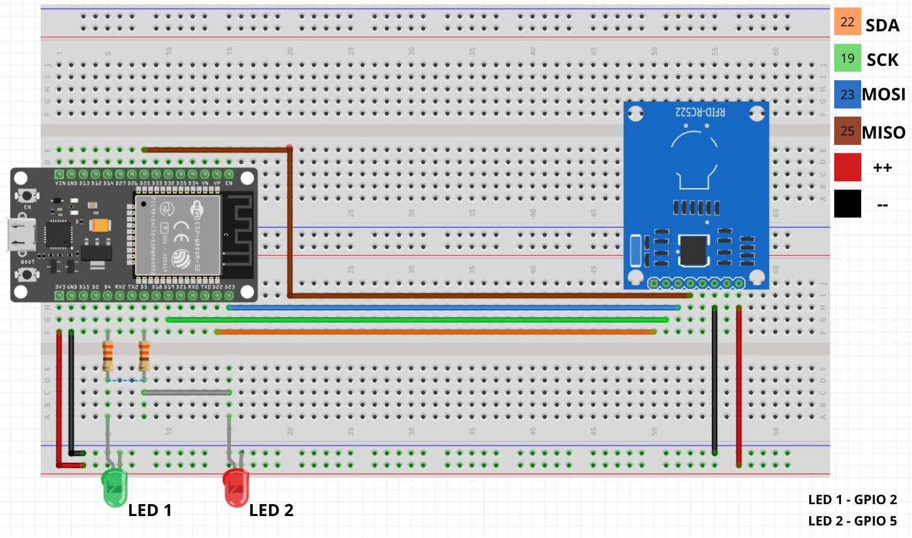
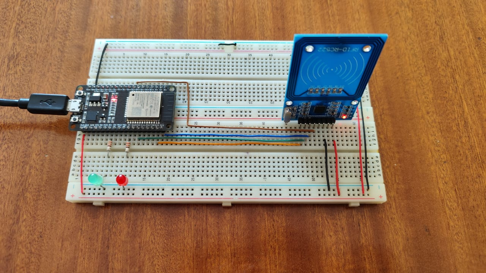
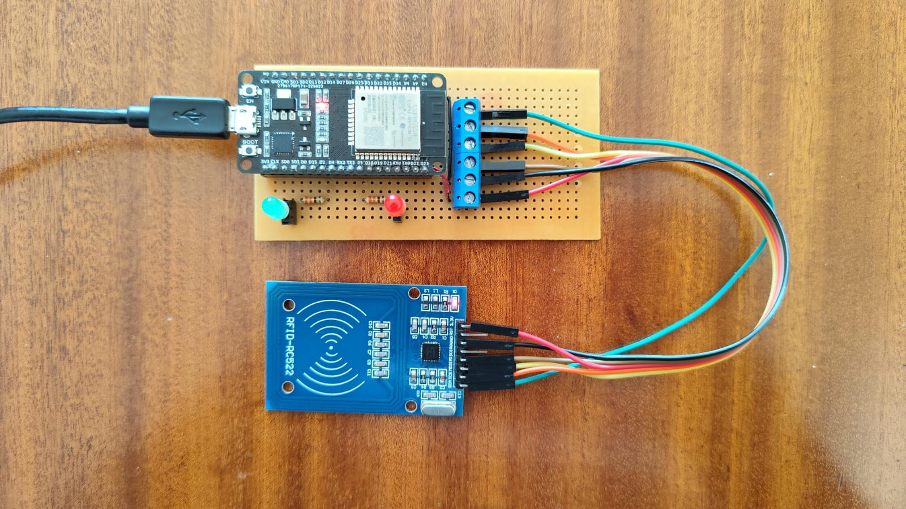
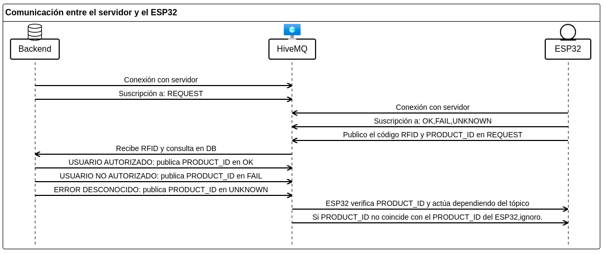

## Sistema de Control de Acceso con ESP32 y conexión Wi-Fi con protocolo MQTT.

En este proyecto tenemos un lector de tarjetas RFID que publica las tarjetas leídas en un cierto tópico. Un servicio Backend recibe esa publicación, verifica que el código RFID pertenezca a un usuario autorizado y publica una respuesta.
## Documentacion
Este proyecto se documentó utilizando Doxygen, una herramienta para generar documentación automática a partir de comentarios integrados en el código fuente.

[Documentación de Doxygen](https://animated-tanuki-521f53.netlify.app/)
---

## Estructura del proyecto



### Observaciones
- **Librerías en `include/`:** Aquí se encuentran los archivos de encabezado que contienen las definiciones de las funciones y estructuras utilizadas en el proyecto.
## Configuración

El archivo `config.h` define las siguientes configuraciones:

#### Pines GPIO

- **LED interno del ESP**: GPIO 2
- **Lector RFID RC522**:
  - MISO: GPIO 25
  - MOSI: GPIO 23
  - SCK: GPIO 19
  - SDA: GPIO 22

#### Configuración MQTT

- **URL del broker MQTT**: `mqtt://broker.hivemq.com`
- **Temas MQTT**:
  - `grupob_request`: Publicación de información de tarjetas RFID
  - `grupob_request1`: Suscripción a comandos de control

#### Configuración Wi-Fi
- **Credenciales Wi-Fi:** Almacena tu SSID y contraseña de Wi-Fi en `wifi_credentials.h` dentro de include.
```c
#ifndef _WIFICREDENTIALS_H
#define _WIFI_CREDENTIALS_H

#define WIFI_CREDENTIALS_ID    ("name")
#define WIFI_CREDENTIALS_PASS  ("password")

#endif
```
## Esp32-pinout  
La placa utilizada para realizar las pruebas tiene la siguiente distribución de pines, en particular esta placa consta de 36 pines, distruidas en hileras de 18 pines, en ambos lados.


  ###### Nota: Revisar que su placa de desarrollo coincida con el pinout.

## Diagrama de conexion.



## Prototipo en protoboard.


## Prototipo en PCB.

###### Nota: Este PCB tambien funciona con el esp32 de 30 pines, ya que cuenta con la adaptacion adecuada. Cuenta con dos jumper para realizar corectamente la distribucion de los pines.

## Funcionamiento.


## Esquema del funcionamiento del dispositivo.




### Manejo de Eventos

#### ESP32 (microcontrolador)
  - **Conexión con el servidor:** En este caso se conecta con el servidor de tipo broker MQTT llamado HiveMQ. El mismo se usa para suscripción y publicación a tópicos.
  - **Publicación código de tarjeta RFID** cuando el usuario acerca una tarjeta o llavero RFID publica en el tópico `grupob_request` el código RFID del objeto escaneado.
  - **Estado autenticación** el sistema se suscribe al tópico `grupob_request1` si el backend autentico de manera exitosa al usuario, el tópico devuelve un 1 de lo contrario va a devolver un 0. El sistema procesa y extrae esta respuesta publicada en el tópico para controlar el estado de los GPIOs.

#### Backend(servidor): [Repositorio de API](https://github.com/facumruiz/rfidhub)
  - Conexión con el servidor El servidor establece una conexión con el ESP32 por medio del broker MQTT. Esto permite que ambos dispositivos se comuniquen entre sí.
  - Extracción numero RFID el sistema se suscribe al `grupob_request` en el cual se hace una publicación del numero RFID escaneado.
  - Publicación del estado de autenticación se publica en el tópico `grupob_request1` el estado de autenticación.

[Video del funcionamiento](https://www.youtube.com/watch?v=89fvR8XMqS8)

Para más detalles sobre la configuración y uso, el archivo generado por Doxygen disponible en [enlace de la documentación](https://animated-tanuki-521f53.netlify.app/)


